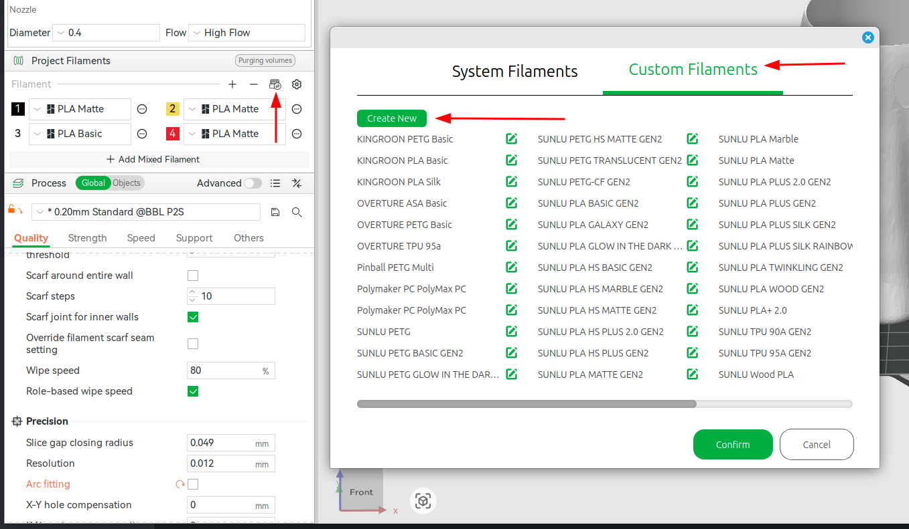
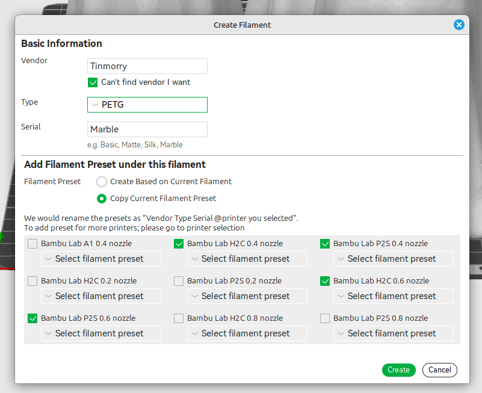
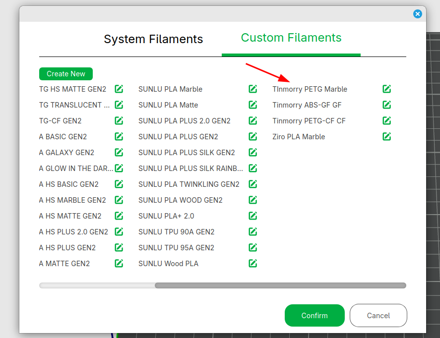
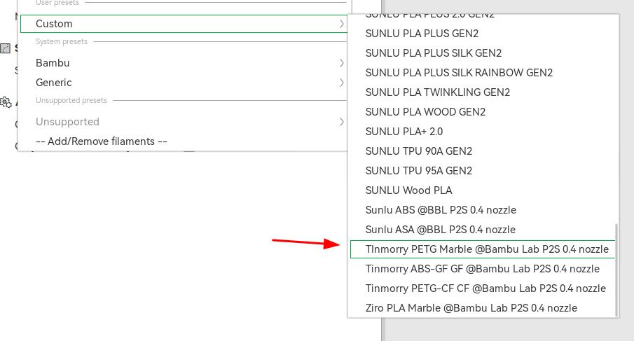
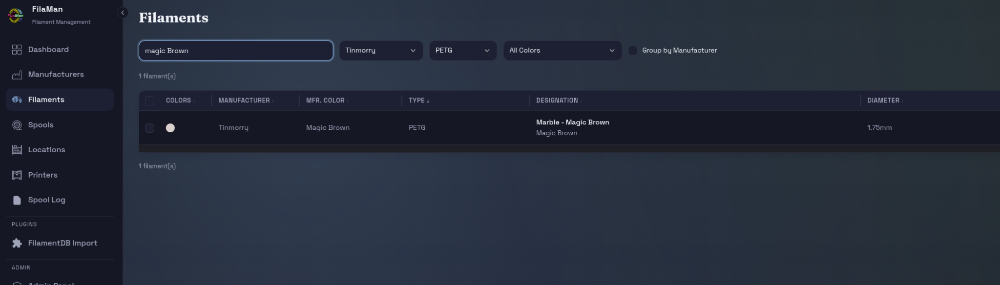
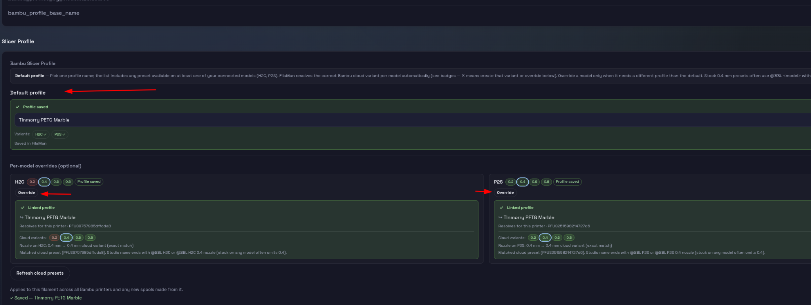
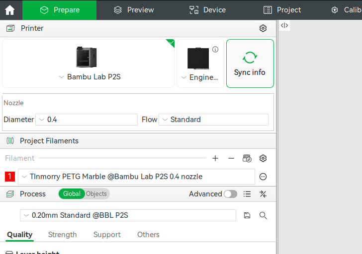
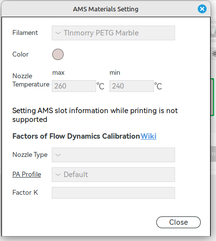

# Automatic Slicer Profiles with FilaMan + Bambuddy

FilaMan, combined with the Bambuddy plugin and Bambuddy itself, can set your Bambu Studio filament profiles automatically — exactly the way official Bambu spools do with Bambu profiles.

The idea: **you create a custom filament preset in Bambu Studio, tell FilaMan its name, and from then on every spool made from that filament auto-selects the right preset in the AMS and Bambu Studio.**

---

## What you need

- **FilaMan**, running.
- **FilaMan's Bambuddy plugin** — currently on the `devel` branch.
- **Bambuddy**, running.
- **Bambu Studio**, with a Bambu Lab cloud account you're signed in to.

## How the workflow fits together

| Phase | Where | What happens |
|---|---|---|
| 1 | Bambu Studio | Create a custom filament preset (once per material) |
| 2 | Bambu Studio | Duplicate it for every printer model + nozzle size you own |
| 3 | FilaMan | Point the filament at that preset's base name |
| 4 | Normal use | Write RFID → scan/weigh → drop in AMS → profile appears |

Step 3 is optional in the strict sense — without it, FilaMan falls back to the Generic or Bambu profile for that material — but it's the whole point of the exercise.

---

## Before you start: add your printers with the right driver

When adding printers in FilaMan, be sure to select the **Bambuddy driver**, *not* the Bambu Lab driver. Nothing else in this guide will work otherwise.

Then open Bambu Studio and confirm **cloud syncing is enabled** in *Preferences*. Profiles travel from Studio to FilaMan via the Bambu cloud, so if syncing is off, FilaMan will never see your custom presets.

---

## Phase 1 — Create the filament preset in Bambu Studio

Go to the **Prepare** tab → **Filament Manager** → **Custom Filaments** tab → **Create New**.

(If a preset for this filament already exists, skip ahead to Phase 2.)



In the **Create Filament** dialog:

1. **Fill out the Basic Information** at the top — Vendor, Type, and Serial. If your vendor isn't in the list, tick *Can't find vendor I want* and type it in. The *Serial* field is the variant name: Basic, Matte, Silk, Marble, and so on.
2. **Under "Add Filament Preset under this filament,"** choose where the settings come from:
   - *Create Based on Current Filament* — start from the selected filament's stock definition.
   - *Copy Current Filament Preset* — copy the tuned settings from the preset you currently have loaded. This is usually what you want if you've already dialed the material in.
3. **Tick every printer + nozzle combination** you want a preset for. This is the step people skip — see Phase 2.



> Note the line in the dialog: *"We would rename the presets as `Vendor Type Serial @printer you selected`."* That generated name is what FilaMan matches on later, so it's worth reading carefully.

Once saved, the new filament appears in the **Custom Filament List**.



Back in the **Prepare** tab, the new preset is now selectable under **Custom**. Note the naming format:

```
<NAME> @Bambu Lab <MODEL> <NOZZLE_SIZE> nozzle
```

For example: `Tinmorry PETG Marble @Bambu Lab P2S 0.4 nozzle`



---

## Phase 2 — Cover every printer model and nozzle size

**This is the step that determines whether the automation works.**

Bambu decided that all filament profiles are specific to both printer model *and* nozzle size. So a preset named `... @Bambu Lab P2S 0.4 nozzle` applies only to a P2S with a 0.4 nozzle — nothing else.

Create a preset with the **same `<NAME>`** for each printer model and nozzle size you actually use. Do that and FilaMan groups them together automatically later. Skip it and, for any combination without a matching preset, the slicer falls back to the Bambu or Generic version of that material.

You can create these all at once in the checkbox grid during Phase 1, or add them afterward by editing the filament in Filament Manager.

**When you're done, exit Bambu Studio.** It syncs to the cloud on exit, and FilaMan reads from the cloud.

---

## Phase 3 — Link the profile in FilaMan

In FilaMan, open the **Filaments** page and pull up the filament for your new spool — or create a new filament if it doesn't exist yet.



Click into the filament and scroll down to the **Slicer Profile** section.



### Default profile

Enter the **base name only** — the common part of the profile group, without the `@Bambu Lab ...` suffix. In the example above, that's just `Tinmorry PETG Marble`.

FilaMan takes that base name and resolves the correct cloud variant for every Bambuddy-connected printer and nozzle size on its own. As long as `<NAME>` matches, it knows that `@Bambu Lab <MODEL> <NOZZLE_SIZE> nozzle` variants belong to the same group.

The **Variants** badges next to the name tell you what it found. A checkmark means that model resolved; an ✗ means there's no variant for it, and you should either create it in Bambu Studio (Phase 2) or set an override below.

### Per-model overrides (optional)

Use an **Override** when a specific printer needs a *different* profile than the default — or when you simply don't have a matching profile for it and want to pick something else by hand.

If there's no profile and no override for a given printer/nozzle, FilaMan uses the Bambu or Generic profile for that material, depending on your settings.

### If the profile doesn't show up

Click **Refresh cloud presets**. Newly created presets often need a nudge before FilaMan sees them — and remember they only reach the cloud after Bambu Studio has been closed.

The setting applies to this filament across all Bambu printers and to any spools made from it. Individual spools can still override it if you want.

---

## Phase 4 — Test it end to end

1. Create a new spool from that filament.
2. Write an RFID tag for that spool.
3. Scan the RFID tag.
4. Place the spool in an AMS slot.
5. Launch Bambu Studio.
6. Sync the AMS in Bambu Studio.

The correct profile should now be selected automatically. 🎉



You can confirm it from the AMS side too — the **AMS Materials Setting** dialog shows the filament and its temperature range as read from the tag.



---

## Troubleshooting

**Nothing changes; I get the Generic or Bambu profile instead.**
The most common cause is a missing variant — you have a preset for one printer/nozzle combination but not the one you're actually printing with. Check the variant badges in FilaMan's Slicer Profile section.

**FilaMan doesn't list my new preset at all.**
Three things to check, in order: cloud syncing is enabled in Bambu Studio Preferences; you fully exited Bambu Studio after creating the preset; you clicked *Refresh cloud presets* in FilaMan.

**The name doesn't match.**
The base name must match exactly, including spacing and capitalization. Copy it from the preset name in Bambu Studio and strip everything from `@Bambu Lab` onward. Watch for stock 0.4 mm presets — those often use the `@BBL <model>` form and omit the `0.4`, which is why FilaMan shows what it matched against under each override card.

**The printer isn't listed under per-model overrides.**
It was probably added with the Bambu Lab driver rather than the Bambuddy driver. Re-add it in FilaMan with the Bambuddy driver.

---

## Quick reference

| Thing | Value |
|---|---|
| Bambu Studio preset name format | `<NAME> @Bambu Lab <MODEL> <NOZZLE_SIZE> nozzle` |
| Stock 0.4 mm presets often look like | `<NAME> @BBL <MODEL>` (nozzle size omitted) |
| What you type into FilaMan | `<NAME>` only |
| Presets needed | One per printer model × nozzle size you use |
| Profiles reach FilaMan when | Bambu Studio is closed (cloud sync) |
| FilaMan printer driver | Bambuddy — never Bambu Lab |
